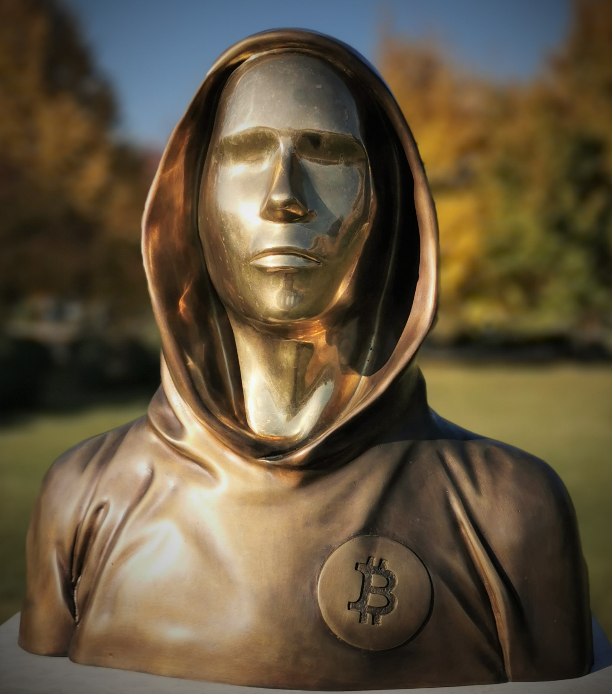

# Introduction (2)

Bonjour et bienvenue dans ce cours consacré à l'histoire de la création de Bitcoin. Je suis votre hôte, Ludovic Lars, et vais vous raconter le long parcours qui a mené à l'apparition et à l'essor progressif de Bitcoin, jusqu'en 2011. L'histoire de la cryptomonnaie est trop souvent méconnue, bien qu'elle regorge de détails fascinants. Nous nous concentrerons, dans ce cours, sur les débuts de Bitcoin : son origine, son lancement et ses premières évolutions.

Avant de commencer le cours proprement dit, en voici un petit aperçu.

 Statue représentant Satoshi Nakamoto à Budapest en Hongrie

Bitcoin a été conçu en 2008 par un individu (ou peut-être un groupe) utilisant le pseudonyme Satoshi Nakamoto. Celui-ci a publié un papier décrivant son modèle à la fin du mois d'octobre via une obscure liste de diffusion de courrier électronique sur Internet. Le 8 janvier 2009, il l'a mis en application en publiant le code source du logiciel et en lançant le réseau, enclenchant le minage des premiers blocs de la chaine. Soucieux d'attirer un nombre critique d'utilisateurs, il a fait la promotion de sa création sur divers canaux de communication.

Après des débuts difficiles, l'amorçage du système a finalement eu lieu en octobre 2009, lorsque l'unité de compte – le bitcoin – a acquis un prix. Les premiers services commerçants sont apparus au début de l'année 2010, à commencer par les services de change qui faisaient le pont avec le dollar. C'est également à cette époque qu'a été implémenté le minage par carte graphique, plus efficace que le minage par CPU, et qu'a eu lieu le premier échange contre un bien physique, en l'occurrence une pizza.

Le projet a réellement pris en ampleur à partir de l'été 2010, suite à la publication d'un article sur le site très populaire Slashdot. Le change avec le dollar, le minage de Bitcoin et le développement informatique du logiciel se sont considérablement améliorés durant cette période. À partir de l'automne, Satoshi Nakamoto s'est progressivement mis en retrait, en arrêtant d'écrire publiquement et en déléguant peu à peu ses tâches. Il a fini par disparaitre complètement au printemps 2011, après avoir transmis ses accès aux personnes de confiance. La communauté naissante de Bitcon a finalement pris le relai et a fait du projet ce qu'il est aujourd'hui.

Outre cette histoire captivante, Bitcoin dispose également d'une pré-histoire. Il n'est en effet pas un objet qui serait sorti de nulle part. Sa création s'inscrit dans un contexte précis : la recherche d'un moyen de transcrire les propriétés de l'argent liquide dans le cyberespace. En particulier, les éléments techniques qui le composent sont le fruit de décennies de recherches et d'expérimentations l'ayant précédé.

D'abord, Satoshi Nakamoto s'est grandement inspiré du modèle eCash, un concept proposé par le cryptographe David Chaum en 1982 et mis en œuvre par le biais de son entreprise DigiCash dans les années 90. Ce modèle, qui reposait sur un procédé de signature aveugle, permettait aux utilisateurs de réaliser des échanges de manière relativement confidentielle. Toutefois, il se basait sur un réseau centralisé de banques qui intervenaient pour empêcher la double dépense. De ce fait, lorsque DigiCash a fait faillite, le système s'est effondré. Nakamoto a corrigé ce problème en permettant de ne plus avoir besoin de tiers de confiance.

Ensuite, la création de Bitcoin s'inscrivait également dans un contexte de fermeture étatique des systèmes de monnaies privées tels que e-gold et Liberty Reserve. Il constituait en cela un modèle robuste de monnaie numérique, pouvant résister aux assauts directs de l'État fédéral américain. En répartissant le risque entre ses participants, à l'instar des systèmes de partage en pair à pair comme BitTorrent, il assurait sa propre survie.

Enfin, le projet Bitcoin est l'héritier de l'éthos du mouvement des cypherpunks, un mouvement de cryptographes rebelles des années 90, qui cherchaient à préserver la confidentialité et la liberté des gens sur Internet, par l'utilisation proactive de la cryptographie. Bitcoin s'inscrit dans la continuité des projets comme b-money, bit gold ou encore RPOW imaginés par ces individus à la fin des années 90 et au début des années 2000. Satoshi Nakamoto y a ainsi fait mention, même s'il n'en avait pas connaissance avant de concevoir Bitcoin.

Ce cours est divisé en quatre parties. La première est consacrée à l'étude des origines de Bitcoin, dont nous venons de parler. La deuxième partie est la description de la lente émergence de Bitcoin entre 2008 et avril 2010. La troisième parle du premier essor de Bitcoin au cours de l'année 2010. La quatrième partie se concentre sur la formation de la communauté de Bitcoin à partir de la fin de l'année 2010.

Prêt à explorer l'incroyable saga de la création de Bitcoin ? Alors, plongeons ensemble dans cette histoire hors du commun !
