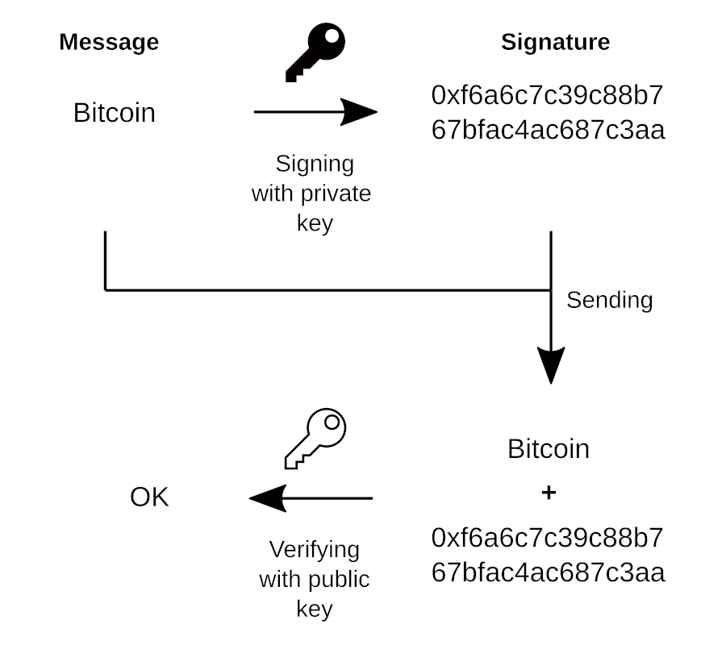
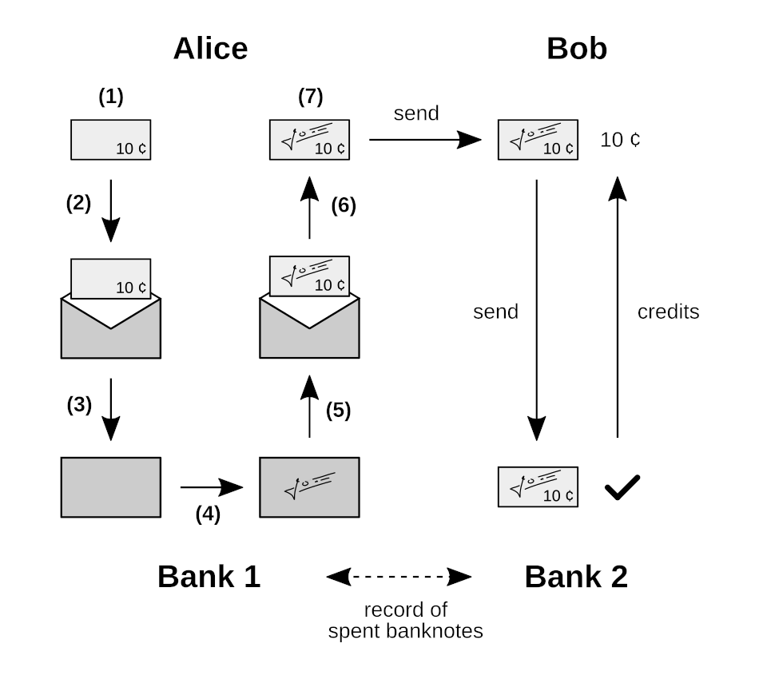
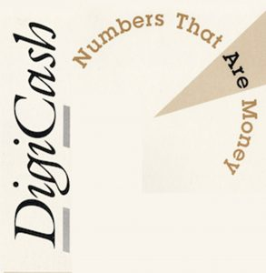
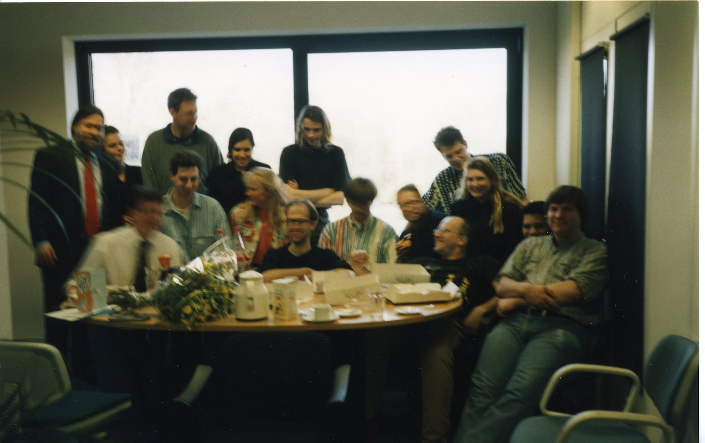

# Chapitre 1 : eCash : l'argent liquide électronique chaumien (2)

Avant d'aborder l'histoire proprement dite de la création de Bitcoin par Satoshi Nakamoto, il convient d'évoquer ce qui l'a précédé. Bitcoin n'est pas sorti de nulle part : il est issu de décennies de recherches et d'expérimentations. Il est en particulier inspiré d'un modèle de monnaie numérique qui a été développé dans les années 1990, appelé eCash.

Le modèle eCash est une application de la cryptographie asymétrique, présentée en 1976 par Whitfield Diffie et Martin Hellman, deux cryptographes de l'université Stanford. Contrairement à la cryptographie symétrique, ce type de cryptographie repose sur deux clés distinctes : une clé privée, censée rester secrète, et une clé publique, dérivée de la clé privée. La clé privée ne peut théoriquement pas être retrouvée facilement à partir de la clé publique, ce qui fait que cette dernière peut être partagée en toute tranquillité.

La cryptographie asymétrique permet à la fois de mettre en place des algorithmes de chiffrement, ayant pour but de dissimuler le contenu d'un message, et des procédés de signature, servant à authentifier l'auteur d'une information. Le chiffrement asymétrique consiste à utiliser la clé publique comme une clé de chiffrement, et la clé privée comme une clé de déchiffrement. La signature numérique repose à l'inverse sur le fait d'utiliser la clé privée comme une clé de signature et la clé publique comme une clé de vérification.

La signature numérique rend possible la monnaie numérique au sens premier. En donnant la possibilité de signer un message, une personne peut prouver mathématiquement qu'elle est propriétaire d'un certain montant d'unités numériques. C'est ce qui anime le jeune crytographe David Chaum lorsqu'il met au point eCash.

 David Chaum dans les années 90 (source : Elixxir)

David Chaum est un informaticien originaire de la côte Ouest et doctorant à l'université de Berkeley. Il se prend très vite de passion pour la protection de la vie privée, étant très inquiet pour l'avenir de la liberté et de la confidentialité dans une société qui s'informatise de plus en plus. C'est ce qui explique son intérêt pour le domaine de la cryptographie, auquel il contribue dès l'année 1979. En 1982, dans un article intitulé « Blind Signature for Untraceable Payments », il publie une description du procédé de signature aveugle, qui permet à un signataire de signer quelque chose sans voir ce qu'il signe. Ce procédé possède plusieurs applications, mais il est surtout à la base de son modèle de monnaie électronique respectueux de la vie privée : eCash.

eCash (contraction de *electronic cash*) est un concept de monnaie numérique permettant à ses utilisateurs de réaliser des paiements qui sont relativement confidentiels. C'est une forme d'argent liquide, dans le sens où les utilisateurs peuvent conserver des billets numériques directement, et non sur un compte géré par un tiers de confiance. Comme David Chaum l'expliquera dans un communiqué de presse en 1996 : « Ecash est une forme numérique d'argent liquide qui fonctionne sur Internet, où l'argent liquide papier ne peut pas exister. Comme les espèces, il offre aux consommateurs une réelle possibilité de cacher ce qu'ils achètent. »

 Les différentes étapes qui interviennent dans la création et le remplacement d'un billet chaumien

Le système repose sur des serveurs, appelés des banques ou des monnaieries, qui émettent et remplacent les billets des utilisateurs à chaque transaction. Lorsqu'un billet est transféré, le destinataire l'envoie à sa banque, qui se charge de le vérifier et de lui en redonner un ou plusieurs autres. Les banques entretiennent chacune un registre des billets dépensés pour empêcher la double dépense. Chaque système eCash est chapeauté par une autorité centrale qui délivre les habilitations.

Chaque billet est généré par un utilisateur, puis signé par une banque pour en assurer l'authenticité, sans que la banque ne puisse identifier le billet. Ce fonctionnement implique qu'aucune banque dans le système ne peut relier le paiement à l'identité de l'utilisateur qui paie, ce qui fait qu'on parle de confidentialité pour le client. Le commerçant est en revanche obligé de passer par une banque pour confirmer le paiement, et sa banque peut donc avoir connaissance des montants reçus. De plus, le système dépend d'un tiers de confiance — l'autorité centrale qui désigne les banques participantes — ce qui le rend fragile par conception.

 Photo (floue) de l'équipe de DigiCash en 1995 : David Chaum se trouve tout à gauche (source : Chaum.com)

En 1990, David Chaum fonde sa propre société, DigiCash B.V., pour mettre en application son idée d'argent liquide électronique. Cette entreprise est installée à Amsterdam aux Pays-Bas et détient les brevets de son invention. À l'époque, Internet est encore naissant, le Web encore en développement, et le commerce électronique inexistant : de ce fait, le modèle eCash constitue une formidable opportunité.

Ce n'est pas l'entreprise de David Chaum qui teste pour la première fois le modèle ; ce sont les cypherpunks, qui le mettent en œuvre sans demander l'autorisation. En février 1994, un développeur se faisant appeler Pr0duct Cypher dévoile un protocole nommé Magic Money qui permet de créer sa propre monnaierie eCash sous la forme d'un serveur de courrier électronique. Les cypherpunks s'amusent avec en créant toutes sortes d'unités de compte comme les Tacky Tokens, les GhostMarks, les DigiFrancs ou encore les NexusBucks. L'utilité de ces jetons est cependant minimale, et les échanges très rares.

Du côté de DigiCash, après quelques années de développement, un prototype est présenté en mai 1994, lors de la première conférence internationale sur le Web au CERN à Genève. La société réalise ensuite un essai qui débute le 19 octobre de cette année, avec l'émission d'unités appelées les « CyberBucks » qui ne sont pas adossées à une autre monnaie. Divers commerçants acceptent les CyberBucks dans le cadre de cette expérience. Les cypherpunks s'approprient également la chose en les utilisant pour procéder à des échanges réels : des t-shirts arborant le code de RSA sont notamment vendus par ce moyen. Les CyberBucks acquièrent ainsi une valeur sur le marché. Cependant, celle-ci s'effondre avec le déploiement d'eCash dans le système bancaire classique.

L'arrivée d'eCash dans le système bancaire commence en octobre 1995 avec le début du partenariat de DigiCash avec la Mark Twain Bank, une petite banque du Missouri. Contrairement au cas des CyberBucks dont le taux de change est flottant, l'unité de compte est adossée au dollar américain. Entre 1996 et 1998, six banques suivent, dont la Deutsche Bank en Allemagne. La presse promet alors à ce système un avenir radieux.

Néanmoins, tout ne se passe pas comme prévu. À cause de son caractère têtu et suspicieux, David Chaum souhaite garder le contrôle sur son entreprise et refuse des partenariats avec de grands acteurs comme ING, Visa, Netscape et Microsoft. Il quitte son poste en 1997. La même année, l'entreprise déménage son siège social en Californie. Durant l'année 1998, les banques partenaires annoncent abandonner eCash. DigiCash finit par faire faillite en novembre 1998, mettant fin à cette expérience de l'argent liquide électronique chaumien.

Le développement du modèle eCash n'est cependant pas infructueux et il est à la base de multiples initiatives, dont nous parlerons dans les prochains chapitres. Il influencera en particulier Satoshi Nakamoto lorsqu'il mettra au point Bitcoin. En ce sens, eCash est le prédécesseur principal de Bitcoin, même s'il n'en est pas le seul. Avec Bitcoin, Satoshi Nakamoto créera une monnaie numérique robuste et confidentielle, un réel argent liquide électronique.

En cela, il réalisera la prédiction du prix Nobel d'économie Milton Friedman, qui disait dans une entrevue en 1999 — je cite : « Je pense qu'Internet va devenir l'une des forces majeures qui va réduire le rôle de l'État. La seule chose qui manque, mais qui sera bientôt développée, c'est un argent liquide électronique fiable, une méthode qui permette de transférer des fonds de A à B sur Internet sans que A connaisse B ou que B connaisse A. »
