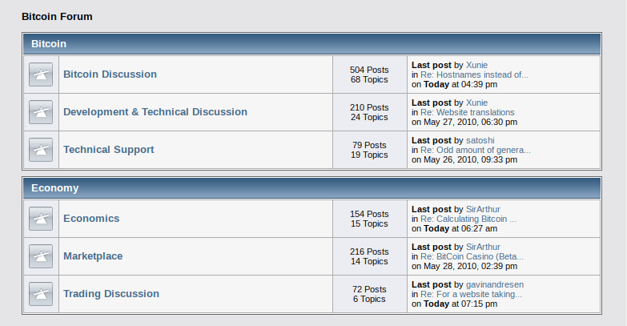

# Chapitre 5 : La présentation au monde (2)

Suite à son lancement au début de l'année 2009, le réseau de Bitcoin fonctionne, mais les nœuds générateurs sont peu nombreux, Satoshi Nakamoto mine la grande majorité des blocs et l'activité est pour ainsi dire inexistante — 32 transactions effectives ont lieu durant le mois de janvier. Le projet ne dispose que d'un site web rudimentaire et d'une page sur SourceForge, la plateforme de gestion de projets où on peut télécharger le logiciel. En outre, la communication à propos de Bitcoin se limite alors à la Metzdowd Cryptography mailing list, suivie au mieux par quelques centaines de personnes passionnées par la cryptographie.

Le défi de cette période est par conséquent de faire la promotion de Bitcoin afin d'attirer une masse critique d'utilisateurs, qui pourront ensuite contribuer au projet d'une manière ou d'une autre. C'est pourquoi Satoshi a pour priorité d'améliorer le site et d'interagir avec diverses personnes. Il veut faire connaître sa découverte au monde.

Le lancement lors du mois de janvier 2009 est l'occasion pour Satoshi d'établir les paramètres fixes de son système. Comme il l'écrira plus tard, la nature de Bitcoin est telle que, « dès la version 0.1 lancée », son fonctionnement de base est « gravé dans le marbre pour le reste de son existence », de sorte qu'il est nécessaire de bien régler les choses avant que le système prenne de l'ampleur. En particulier, deux éléments fondateurs revêtent une importance culturelle majeure : le contenu du bloc de genèse et la limite des 21 millions d'unités.

 La une du *Times* du 3 janvier 2009

Le bloc de genèse est le bloc de base de la chaîne de blocs de Bitcoin, à partir duquel elle doit être prolongée. Il est par conséquent inscrit en dur dans le logiciel. Avant le lancement du réseau, Satoshi construit ce premier maillon en produisant la preuve de travail requise et en l'horodatant au 3 janvier 2009 à 18 heures 15. Dans ce bloc, et plus précisément dans la transaction de récompense, il inclut le titre de la une du quotidien britannique *The Times* de ce jour-là, qui indique que le chancelier de l'Échiquier — c'est-à-dire le ministre des finances du Royaume-Uni — est sur le point de renflouer les banques pour la seconde fois.

Cette inscription a pour intérêt d'empêcher l'antidatage du lancement du réseau en prouvant que le système n'a pas démarré avant le 3 janvier. Mais elle revêt aussi un aspect symbolique en indiquant ce à quoi Bitcoin s'oppose en faisant référence au contexte monétaire et financier de cette période. À l'époque, le monde subit en effet de plein fouet les effets de la crise financière amorcée en 2007 par l'éclatement de la bulle des subprimes aux États-Unis. Les États renflouent les institutions financières pour éviter de nouvelles faillites après la chute de la banque d'investissement Lehman Brothers survenue le 15 septembre 2008, et les banques centrales procèdent à des assouplissements quantitatifs en injectant des liquidités sur les marchés financiers. Cette utilisation d'argent public créé pour l'occasion, a pour effet de troubler un certain nombre de citoyens qui réalisent que le système bancaire est en réalité un système de profits privés et de pertes socialisées. Bitcoin, quant à lui, contraste ainsi avec les monnaies étatiques, en n'étant pas soumis à l'arbitraire d'une banque centrale.

La politique monétaire du bitcoin est en effet programmée à l'avance, inscrite dans le protocole, pour en théorie ne jamais être altérée. Cela nous amène au second élément présenté par Satoshi le jour du lancement du réseau : la limite des 21 millions. Le 8 janvier, dans son courriel d'introduction, il décrit la politique d'émission des bitcoins de la façon suivante :

« Le nombre total d'unités en circulation sera de 21 millions. Elles seront distribuées aux nœuds du réseau lorsqu'ils créeront des blocs, la quantité émise étant divisée par deux tous les 4 ans. \[...\] Une fois cette somme épuisée, le système pourra prendre en charge les frais de transaction si nécessaire. »

Quelques jours plus tard, Hal Finney réagit favorablement à cette politique monétaire sur la liste en s'enthousiasmant du fait que « le système peut être configuré de manière à n'autoriser qu'un certain nombre maximum d'unités à être générées ». Dans son courriel, il estime que si Bitcoin devient « le système de paiement dominant utilisé dans le monde entier », chaque unité aura alors « une valeur d'environ 10 millions de dollars ». Il conclut en écrivant que « la possibilité de générer des unités aujourd'hui avec quelques centimes de temps de calcul » peut constituer « un très bon pari ». Même si l'estimation est contestable (car elle se base sur une valorisation du bitcoin qui serait équivalente à la totalité de la richesse mondiale), le raisonnement se tient.

Le 16 janvier, Satoshi reprend cette idée d'« investissement à long terme » en en faisant part à la liste de diffusion. Il déclare alors qu'il « pourrait être judicieux de s'en procurer au cas où le phénomène prendrait de l'ampleur » et que « si suffisamment de gens pensent la même chose, on pourra assister à une prophétie autoréalisatrice ». Il réitère cette affirmation un mois plus tard en expliquant que le montant limité d'unités est susceptible de créer une « boucle de rétroaction positive » dans le sens où « plus les utilisateurs sont nombreux, plus la valeur augmente, ce qui peut attirer davantage d'utilisateurs désireux de profiter de cette hausse ». De ce fait, l'élément spéculatif est présent dès le départ dans la communication autour de Bitcoin, afin d'amorcer le système.

Le 11 février, Satoshi publie un message d'introduction présentant Bitcoin sur le forum de la P2P Foundation. Dans ce texte, il écrit — je cite :

« Le problème fondamental de la monnaie conventionnelle est toute la confiance nécessaire pour la faire fonctionner.  Il faut faire confiance à la banque centrale pour qu'elle ne déprécie pas la monnaie, mais l'histoire des monnaies fiat est pleine de violations de cette confiance.  Il faut faire confiance aux banques pour détenir notre argent et le transférer par voie électronique, mais elles le prêtent par vagues de bulles de crédit avec à peine une fraction en réserve.  Nous devons leur faire confiance pour protéger notre vie privée, pour ne pas laisser les voleurs d'identité vider nos comptes.  Leurs frais généraux considérables rendent les micropaiements impossibles. »

 Capture de la page personnelle de Satoshi sur le forum de la P2P Foundation

Sur son profil, il indique être un homme japonais, mais ce n'est pas tout. Une mise à jour de l'interface en 2011 fera apparaître son âge, puis on découvrira en 2014 qu'il a indiqué une date de naissance particulière : le 5 avril 1975. Cette date, d'apparence bénigne, est vraisemblablement une date composite faisant référence à l'interdiction pour les citoyens américains de détenir de l'or entre 1933 et 1975 aux États-Unis. Le jour du 5 avril se rapporte au jour de l'instauration de cette interdiction par l'Ordre exécutif 6102 signé par le président Franklin Delano Roosevelt le 5 avril 1933. L'année 1975, quant à elle, correspond à son année d'abrogation lors de l'entrée en vigueur de la Public Law 93-373. Ce détail est très important puisque c'est cette prohibition qui a mis fin à l'étalon-or classique — où chacun pouvait obtenir de l'or en échange d'un billet représentatif —, qui a permis de dévaluer le dollar — par le biais du Gold Reserve Act en 1934 —, et qui a facilité l'instauration du régime monétaire à taux de change flottants que nous connaissons depuis le Nixon Shock de 1971.

Satoshi Nakamoto est aussi actif sur la liste de diffusion de la fondation, où il échange notamment avec Martien van Steenbergen, un consultant en gestion de projet néerlandais. Le 13 février, il aborde le sujet de la programmabilité de Bitcoin et écrit à ce dernier qu'il « considère Bitcoin comme une pierre angulaire, comme une première étape si l'on veut mettre en œuvre des monnaies sociales de pair à pair programmables ».

La stratégie de communication de Satoshi porte peu à peu ses fruits. Le message se diffuse progressivement. Au fil des mois, Satoshi interagit ainsi avec plusieurs personnes qui souhaitent s'impliquer dans Bitcoin, dont en particulier deux individus.

 Mike Hearn

Le premier est Mike Hearn, un développeur britannique de 24 ans travaillant pour Google depuis la Suisse, et s'adonnant au logiciel libre sur son temps libre. Ce dernier s'intéresse alors aux systèmes de paiement numériques, et en particulier à Ripple. C'est justement sur le Google Group de Ripple qu'il entend parler de Bitcoin. Il contacte Satoshi le 12 avril, avec qui il discute des différents aspects de Bitcoin, et notamment de son choix pour le nombre de 21 millions. À ce sujet, Satoshi explique qu'il voulait « choisir quelque chose qui rendrait les prix similaires à ceux des monnaies existantes ».

 Martti Malmi en 2013 (source : Business Insider)

Le second est Martti Malmi, un jeune étudiant en informatique finlandais, qui découvre Bitcoin au début du mois d'avril, par l'intermédiaire du forum de la P2P Foundation. Le 9 avril, il publie un texte aux accents anarchistes sur deux forums libertariens. Il l'envoie à Satoshi, qui approuve et lui dit que sa « compréhension de Bitcoin » est « en plein dans le mille ». Dans son courriel, Martti écrit aussi qu'il « aimerait aider avec Bitcoin » même s'il n'a « pas encore beaucoup d'expérience en matière de développement ».

Peu à peu, Martti Malmi deviendra le bras droit de Satoshi. Il est d'abord chargé de remplir la page web sur SourceForge, où il présente Bitcoin comme une « monnaie numérique anonyme basée sur un réseau pair à pair », description qui sera reprise sur Bitcoin.org. Le 8 mai, il fait la promotion de la page en partageant un lien sur les plateformes Hackernews et Reddit.

 Le forum de Bitcoin en mai 2010

Ensuite, Martti a la responsabilité de mettre en place un forum. Le forum est hébergé sur SourceForge et ouvre le 9 juin. Celui-ci rencontre son succès, à tel point qu'il est nécessaire de créer un nouveau forum ayant son hébergement dédié. C'est chose faite au début du mois de décembre avec l'inscription des premiers membres et l'ouverture des premières discussions. L'URL est bitcoin.org/smf. Celui-ci deviendra Bitcointalk en août 2011.

Enfin, Martti participe aussi au développement du logiciel, et aide notamment Satoshi à l'adapter à Linux. La version 0.2 est publiée le 16 décembre, ce qui marque la première étape dans la croissance de Bitcoin.
