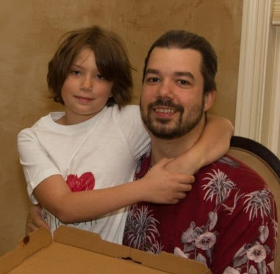
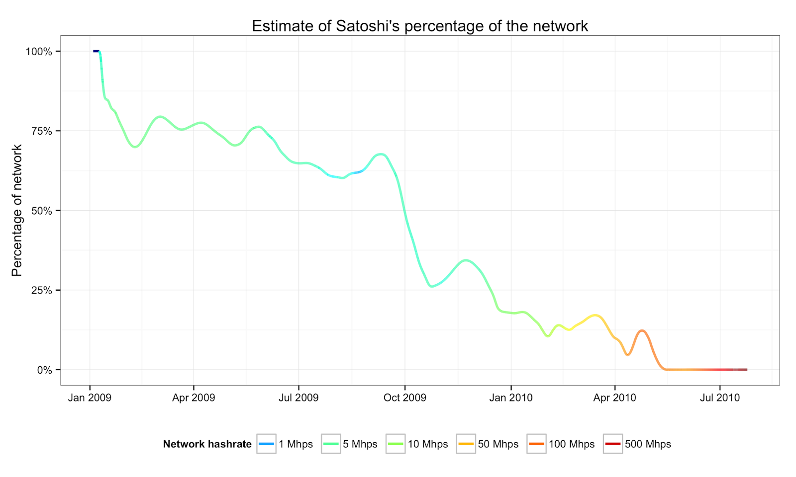

# Chapitre 7 : Cartes graphiques, pizzas et bitcoins gratuits (2)

Au printemps 2010, le commerce en bitcoins bourgeonne à peine, mais des éléments montrent que le système est en train de progresser.

Le premier élément est le minage. Durant toute l'année 2009, la difficulté sur le réseau est restée au plancher minimal de 1, qui imposait à tous les nœuds de réaliser environ 4,3 milliards de calculs pour miner un bloc. Cependant, à la fin du mois de décembre, la puissance de calcul totale était suffisante pour déclencher l'algorithme d'ajustement, qui a fait passer le facteur de difficulté de 1 à 1,18. Ce facteur a augmenté de nouveau dans les mois qui ont suivi, étant multiplié par 10 entre janvier et mai.

C'est alors que se produit la première vague de spécialisation du minage. Jusqu'en mai, les mineurs sollicitaient leurs processeurs centraux (ou CPU) pour extraire les nouveaux bitcoins. Néanmoins, ces processeurs s'avèrent peu performants pour effectuer des opérations répétées, comparés aux processeurs graphiques (ou GPU) qui sont largement plus adaptés à ce type de calcul répétitif. Par conséquent, tout le monde sait à ce moment-là que cette évolution est inéluctable.

Satoshi Nakamoto a une position nuancée sur le sujet. D'un côté, il se réjouit de l'accroissement de la puissance de calcul, qui améliore la sécurité du réseau. De l'autre, il voit d'un mauvais œil l'arrivée rapide de la spécialisation du minage. Il désire en effet favoriser une distribution large des unités et cherche à ralentir les mineurs les plus performants. Il déclare ainsi en décembre 2009 que la communauté doit « se mettre d'accord pour reporter la course aux armements des processeurs graphiques aussi longtemps que possible pour le bien du réseau ».

 Laszlo Hanyecz avec son fils en mai 2018 (source : The Telegraph)

Cependant, quelques mois plus tard, la boîte de Pandore est ouverte par Laszlo Hanyecz, un développeur américain d'origine hongroise de 28 ans qui vit en Floride. Après avoir découvert Bitcoin en avril, il s'est procuré des unités pour essayer le système en faisant quelques transferts sur le réseau, puis a adapté le code du logiciel pour le faire fonctionner sur Mac OS X. Il développe ensuite un logiciel permettant de faire intervenir le GPU dans la génération de bitcoins et publie l'exécutable sur le forum le 10 mai. Cette optimisation lui permet d'occuper rapidement une place importante dans la production des blocs.

Il contacte Satoshi pour lui demander son avis, mais ce dernier ne lui répond que le 17 mai. Le créateur de Bitcoin lui demande alors de ralentir ses opérations afin que le minage reste accessible pour le plus grand nombre. Il écrit — je cite : « Je ne veux pas passer pour un socialiste, je me moque de la concentration des richesses, mais pour l'instant, nous obtenons plus de croissance en donnant cet argent à 100 % des gens qu'en le donnant à 20 %. » Laszlo ne tient pas vraiment compte de cet avertissement et continue de miner des blocs avec sa carte graphique. Il génèrera ainsi des dizaines de milliers de bitcoins au cours des mois qui suivront.

 source : Organofcorti, 2014

L'essor du minage a aussi une conséquence importante : il pousse Satoshi à arrêter son activité minière personnelle. Après le lancement du réseau, il s'attachait à miner autant que possible afin d'assurer un rythme de confirmation suffisant et un niveau de sécurité acceptable. Mais la prise de relai par les autres membres du réseau lui permet d'abandonner cette tâche. Il ralentit ainsi progressivement son taux de hachage pour s'adapter à la hausse concomitante, dans la perspective altruiste de laisser les autres profiter de l'entièreté de la récompense de minage. Ainsi, la proportion de la puissance de calcul de Satoshi par rapport à la puissance totale du réseau baisse au fil du temps : elle passe de 75 % en mars 2009 à 60 % en septembre, pour descendre jusqu'à 15 % en décembre et atteindre les 0 % en mai.

Au total, il a ainsi miné environ 22 500 blocs et accumulé environ 1,1 million de bitcoins, soit plus de 5 % des 21 millions d'unités prévues. Cette quantité représentera une fortune considérable avec la hausse du taux de change.

 Photographie des deux pizzas, partagée par Laszlo lui-même

Le mois de mai 2010 est également marqué par un évènement fondateur : le premier achat d'un bien physique en bitcoins, par Laszlo Hanyecz (toujours lui). Alors qu'il a accumulé plus de 20 000 bitcoins grâce à son algorithme, il cherche à les réinjecter dans l'économie en obtenant des pizzas. Le 18 mai, il écrit ainsi une annonce sur le forum où il dit qu'il est prêt à payer « 10 000 bitcoins pour deux ou trois pizzas », afin qu'il lui « en reste le lendemain ». L'offre trouve preneur au bout de quatre jours, le 22 mai, en la personne de Jeremy Sturdivant, un jeune étudiant californien. Ce dernier commande deux pizzas de Papa John's et les fait livrer chez Laszlo en Floride. Il reçoit en échange 10 000 bitcoins, soit environ 44 dollars au cours de Bitcoin Market. Cela clôt le premier achat d'un bien physique en bitcoins, même si cet achat est indirect. Cet évènement est alors célébré par la communauté sur le forum. Il sera par la suite commémoré à la même date comme le *Bitcoin Pizza Day*.

 Gavin Andresen à Townsville dans le Queensland en Australie (source : archive de CIO)

La période voit enfin l'arrivée d'un personnage clé de l'histoire de Bitcoin : Gavin Andresen, un développeur de 44 ans qui vit alors à Amherst dans le Massachusetts. De retour de voyage en Australie et momentanément sans emploi, ce dernier apprend l'existence de Bitcoin à la fin du mois de mai par l'intermédiaire d'un article publié sur InfoWorld, présentant le projet de Nakamoto comme une « innovation open source ». Curieux et inventif, Gavin se met rapidement à travailler sur un projet personnel : un « Bitcoin Faucet », qui donne des bitcoins à quiconque en fait la requête. Ce service permet aux intéressés d'obtenir facilement quelques unités (5 bitcoins au départ) pour essayer le système. Satoshi accueille favorablement le lancement de ce service, expliquant qu'il l'aurait développé lui-même si personne ne s'était manifesté.

La contribution de Gavin Andresen ne s'arrête pas là. Il s'intéresse profondément à la façon dont Bitcoin fonctionne et entreprend de disséquer le code. Il s'implique également dans le développement du logiciel en implémentant le lancement automatique au démarrage pour Linux, en s'intéressant à l'API, et en participant au déploiement du réseau de test, dont il a l'idée le 9 juin. Il échange en privé avec Satoshi, et en devient progressivement le bras droit, Martti Malmi étant très occupé avec un nouvel emploi à plein temps.

Ces éléments fondateurs montrent une progression encourageante de Bitcoin. Cependant, à la fin du mois de juin, l'activité demeure assez modeste sur le réseau. Les nouveaux utilisateurs sont peu nombreux et la flamme du phénomène monétaire a tout juste de quoi ne pas s'éteindre. Le 30 juin, sur la liste de diffusion de Bitcoin, le cypherpunk James A. Donald — qui ne semble pas avoir suivi les dernières avancées, ni n'avoir connaissance de l'existence du forum — déclare que « Bitcoin est en quelque sorte mort ».

Même si l'avenir lui donnera tort, son commentaire révèle un manque criant de communication : un nombre trop restreint de personnes a connaissance du projet, et il faut faire plus d'efforts dans ce sens. Bitcoin a, d'après Donald, « besoin d'une écologie d'utilisateurs pour être utile » et cette masse critique n'est pas encore là. Mais ça ne saura tarder...
