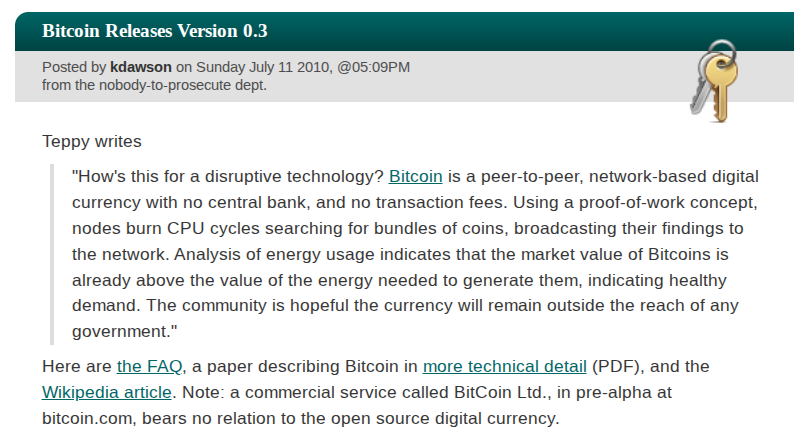
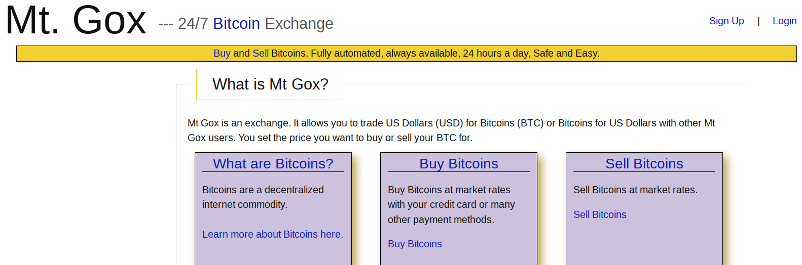

# Chapitre 8 : Le grand slashdotting (2)

Au début de l'été 2010, en dépit de premiers développements encourageants, Bitcoin repose encore sur une base fébrile. Le logiciel compte peu de développeurs hormis Satoshi Nakamoto. Les mineurs sont pour la plupart des amateurs qui se servent de leur ordinateur personnel. Il existe une vingtaine de services liés à Bitcoin et les échanges effectifs sont tout aussi rares. Toutefois, les choses sont sur le point de changer.

Cette période est marquée par la sortie de la version 0.3 du logiciel, qui a été préparée de longue date par Satoshi et par Martti Malmi. Par rapport à la version 0.2, sortie en décembre de l'année précédente, cette version inclut des améliorations cruciales telles qu'un programme s'exécutant en arrière-plan — programme qui deviendra bitcoind —, un contrôle en invite de commande, une API, une optimisation de la génération d'unités, et un « hashmètre » estimant le taux de hachage de l'utilisateur. Elle inclut aussi le support pour Mac OS apporté par la contribution de Laszlo Hanyecz et la traduction de l'interface graphique en plusieurs langues.

Le 22 juin, Satoshi demande aux membres du forum de tester cette variante du logiciel. Il voit la sortie de cette nouvelle version comme un moment charnière du développement de Bitcoin et envisage même d'abandonner la phase « beta », en faisant directement passer la numérotation à 1.3 plutôt que 0.3. Il revient néanmoins assez rapidement sur ce projet.

Le 6 juillet, Satoshi annonce la sortie de la version 0.3 du logiciel. Sachant que cette étape risque d'être importante pour l'avancée de Bitcoin, il soigne la présentation. Il décrit Bitcoin comme une « cryptomonnaie pair à pair » et en vante tous les avantages, notamment le fait que « le nombre total de bitcoins en circulation est limité à 21 millions d'unités ».

À l'occasion de cette sortie, Teppy — l'administrateur du MMORPG qui a commencé à accepter le bitcoin en mai — propose de faire la promotion de Bitcoin sur Slashdot, un site d'actualité très populaire traitant de sujets pour les geeks comme l'informatique, les jeux vidéos, la science, Internet, etc. Le 22 juin, il demande ainsi sur le forum s'il ne faut pas « faire un peu de publicité », en précisant que « Slashdot est un bon endroit » si on peut accéder. Martti Malmi commente en écrivant qu'« atteindre Slashdot, avec ses millions de lecteurs techniquement compétents, serait génial, peut-être la meilleure chose que l'on puisse imaginer ! »

Le 5 juillet, Teppy rédige donc une présentation qu'il publie sur le forum, dans le but de la faire relire avant de la soumettre à Slashdot. Il y décrit notamment Bitcoin comme une « technologie disruptive » et une « cryptomonnaie anonyme ». Son texte fait réagir Satoshi qui écrit qu'il « apprécie l'effort », mais qu'« il y a beaucoup de choses qui ne vont pas », puis il liste les éléments qui le gênent. À propos de la confidentialité du système, il affirme qu'il ne veut pas « mettre l'aspect "anonyme" au premier plan » et qu'il avait « l'intention de modifier la page d'accueil » dans ce sens. Dans un courriel adressé à Martti Malmi, Satoshi donne deux raisons principales pour expliquer cette volonté de mettre en retrait l'anonymat dans la communication : le danger pour l'utilisateur — Bitcoin n'est pas parfaitement confidentiel — et la perception du public — qui associe l'anonymat à l'illégalité. Il conclut son message sur le forum par — je cite : « Désolé d'être rabat-joie.  L'écriture d'une description de ce truc pour le grand public est sacrément difficile.  Il n'y a rien à quoi se rapporter. »

Le 11 juillet, une version rectifiée de la présentation de Bitcoin rédigée par Teppy est publiée sur Slashdot. La publication est remarquée, et près de 500 commentaires sont publiés en quelques jours. Du côté de Bitcoin, l'attention apportée par Slashdot provoque un afflux massif de visiteurs sur le site et sur le forum — ce qu'on appellera le « grand slashdotting ». L'utilisation de la chaine explose : le nombre de transactions quotidiennes effectuées sur le réseau passe de 42 le 10 juillet à 1 641 le 12, pour atteindre 5 554 le 14, un record absolu. Le système tient le choc malgré la montée en charge, et le développeur Gavin Andresen se réjouit de sa solidité.

La première conséquence de cet afflux est que le prix du bitcoin connaît une hausse fulgurante, en passant de 0,008 $ à 0,08 $ en une semaine, soit une multiplication par 10 ! Un autre effet est l'accroissement de la puissance de calcul déployée sur le réseau. Beaucoup de personnes lancent le logiciel et produisent des blocs avec leurs processeurs centraux. Entre le 11 et le 17 juillet, le taux de hachage — le nombre de calculs réalisés chaque seconde — est aussi décuplé, passant de 0,22 à 2,78 gigahachages par seconde.

 Jed McCaleb en 2013 (source : Ariel Zambelich pour Wired)

Parmi les personnes qui découvrent Bitcoin grâce à Slashdot, il y a un certain Jed McCaleb, un entrepreneur et programmeur américain de 35 ans, connu pour avoir cofondé et développé le logiciel de partage de fichiers en pair à pair eDonkey2000. Constatant à quel point il est pénible de se procurer du bitcoin contre des dollars, ce dernier décide, « sur un coup de tête », de créer une place de marché performante. Pour ce faire, il réutilise un de ses anciens projets mis au point en 2007 : Magic The Gathering Online eXchange, un site web qui permettait d'acheter et de vendre des cartes du jeu en ligne Magic. Il reprend le nom de domaine de ce projet — MTGOX.com — qui donne son nom à la nouvelle plateforme : Mt. Gox.

 Interface de la plateforme Mt. Gox en février 2011

Une semaine plus tard, le 18 juillet, Jed lance sa plateforme de change et l'annonce sur le forum. Grâce à son expertise, il fait en sorte que la plateforme fonctionne comme une place de marché automatisée, à l'instar des bourses en ligne modernes. D'après lui, elle se distingue de Bitcoin Market par le fait qu'elle est « toujours en ligne, automatisée », que « le site est plus rapide et a un hébergement dédié » et que « l'interface est plus agréable ». Par conséquent, Mt. Gox s'impose rapidement comme le moyen principal de se procurer du bitcoin, devenant la référence en ce qui concerne la cotation en dollars.

Initialement, la plateforme accepte les paiements via PayPal. Cependant, en octobre 2010, suite à de trop nombreuses demandes de rétrofacturation, PayPal bloquera le compte de Jed, ce qui le contraindra à suspendre momentanément les dépôts et les retraits sur la plateforme. Quelques semaines plus tard, il rétablira les transferts en ajoutant Liberty Reserve comme moyen de paiement. Par la suite, il acceptera également sur demande les transactions via Paxum, et les virements bancaires en dollars et en euros.

L'effet de la publication du texte de présentation de Bitcoin sur Slashdot est ainsi spectaculaire pour le projet de Satoshi Nakamoto. L'afflux de personnes intéressées explose tous les compteurs. C'est à ce moment-là qu'on peut considérer que le projet est réellement amorcé. Et pour preuve : les améliorations techniques, économiques et minières continueront de fleurir dans les mois qui suivront.
