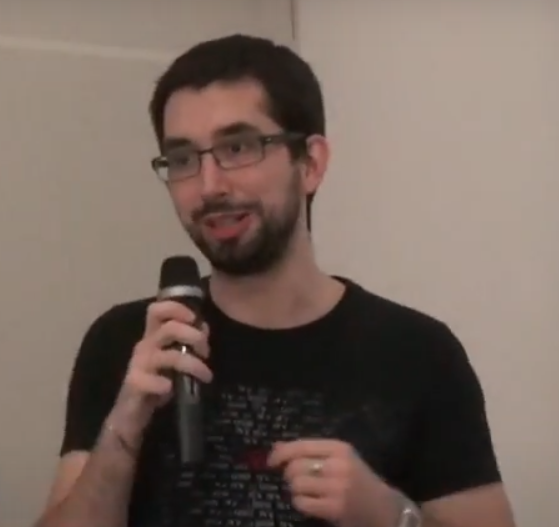

# Chapitre 10 : La ruée vers l'or numérique (2)

À la fin de l'été 2010, le projet a tenu le choc et est prêt à accueillir un nombre croissant de personnes. L'automne constitue une période de progrès pour Bitcoin, et il est en particulier très fastueux pour le minage. Les moyens déployés s'accroissent et la performance des algorithmes consacrés s'améliorent, généralisant peu à peu le minage par processeur graphique. Il s'agit en quelque sorte d'une « ruée vers l'or numérique », comme l'écrit un blogueur de l'époque, constatant que des « milliers d'internautes » minent des bitcoins « dans l'espoir de faire fortune » et que beaucoup d'entre eux tentent « de développer des outils logiciels et matériels pour miner des bitcoins plus efficacement ».

Le plus gros mineur de cette période est un développeur allemand qui se fait appeler ArtForz. Après avoir l'existence de Bitcoin par le biais de Slashdot, il s'investit rapidement dans le développement du logiciel et passe beaucoup de temps sur le canal IRC #bitcoin-dev, une salle de tchat en ligne consacrée au côté technique de Bitcoin. En particulier, il programme son propre algorithme de minage par GPU, qu'il fait fonctionner avec la carte graphique de son ordinateur.

Il se met à générer des bitcoins le 19 juillet. Six jours plus tard, il affirme avoir généré 1 700 bitcoins, ce qui correspond à un taux de hachage de 80 mégahachages par seconde. Peu à peu, il construit une grande ferme de minage, qui sera connue sous le nom d'« ArtFarm ». En août, sa ferme comprend six ATI Radeon HD 5770, ce qui lui permet de passer de 76 mégahachages par seconde le 9 août, à environ 450 le 13.

 Production minière d'ArtForz entre août et octobre 2010 (source : Blackburn et al.)

La progression est vertigineuse et, au fil des semaines, ArtForz en vient à contrôler une portion importante de la puissance de calcul du réseau. Le 2 septembre, on dit qu'il possède « environ 12 \[cartes\] 5770 » et qu'il dépasse le gigahachage par seconde, lui donnant « 20 % de la capacité de hachage » du réseau. Le 23 septembre, ArtForz déclare détenir un taux de hachage de près de 2 gigahachages par seconde et représente alors encore 20 % du hachage total. Enfin, le 3 octobre, Theymos affirme que ArtForz « dispose de 20 à 30 % de la puissance de calcul du réseau ».

Toutefois, cette position est concurrencée au cours de l'automne par d'autres individus qui se mettent à jour. Par la suite, ArtForz s'éloignera progressivement de l'activité minière pour se concentrer sur le développement logiciel. Un an plus tard, il affirmera avoir moins de 1 % de la puissance de calcul du réseau.

Au début de l'automne, l'exemple d'ArtForz inspire ainsi d'autres mineurs, qui s'empressent de développer leurs propres méthodes pour générer des bitcoins avec leurs processeurs graphiques. Pour ce faire, les mineurs utilisent des environnements de programmation comme CUDA ou OpenCL. Cela leur permet d'obtenir une puissance de calcul se comptant en mégahachages par seconde et de représenter une part non négligeable de la puissance totale.

Le 2 septembre, un mineur se faisant appeler Puddinpop partage l'exécutable de son client de minage, exploitant un algorithme utilisant CUDA. Il y intègre la perception de 10 % pour quiconque l'exploite. Cette façon de faire ne plaît pas particulièrement aux membres de la communauté, qui sont généralement attachés au logiciel libre.

Le 6 septembre, suite à la suggestion d'un membre du forum, Puddinpop affirme qu'il serait « peut-être disposé à rendre le code open source » s'il recevait « un don important ». Le 15, Jeff Garzik lui fait une offre dans ce sens en lui proposant 10 000 bitcoins, ce qui représente environ 600 $ à ce moment-là. Puddinpop accepte : la transaction a lieu le 18 et l'algorithme est publié sous licence libre dans la foulée. D'autres algorithmes sont rendus publics dans le même temps, comme celui de Nelisky ou le « mineur OpenCL pour la masse » de m0mchil.

Cette amélioration permet aux individus les plus compétents techniquement de générer beaucoup de bitcoins. Outre ArtForz, on voit notamment Nils Schneider, alias tcatm, s'imposer comme l'un des principaux mineurs de la période. Le 3 octobre 2010, ce dernier affirme avoir un taux de hachage de 983 mégahachages par seconde produit par 3 processeurs graphiques. Ce nombre a pour effet d'étonner Satoshi Nakamoto en personne.

La taux de hachage total augmente en conséquence : de 2,78 gigahachages par seconde le 17 juillet, il passe à 5,79 le 15 août, puis 9,94 le 19 septembre et enfin 12,58 le 29.

La hausse de la difficulté due à la spécialisation du minage a cependant pour conséquence principale de rendre difficile la génération par CPU, qui devient de moins en moins abordable. En effet, la possibilité de générer des bitcoins est de plus en plus dépendante de la variance, certains individus n'arrivant jamais à produire un bloc. La solution à ce problème est le minage coopératif.

Le 1er octobre, le mineur m0mchil publie une modification de l'API qui permet aux nœuds clients de récupérer un bloc candidat par le biais d'une nouvelle fonction, appelée getwork, et de renvoyer la preuve de travail si une solution est trouvée. Il écrit que ce correctif « ouvre la voie aux mineurs de bitcoin externes » et « permet le montage de plusieurs mineurs pour un client ».

Le même jour, l'idée de « génération groupée » est évoquée par un membre du forum dans un fil intitulé « Comment renverser les oligarques du GPU ? ». Le 13 octobre, Puddinpop propose un modèle de ce type. La puissance de calcul du hacheur est mesurée à l'aide d'un métahachage, qui est l'empreinte d'un tampon incluant le premier octet de chaque hachage du bloc. Le serveur peut alors vérifier périodiquement que le client procède bien au calcul tel qu'il a été défini. Ce modèle est complexe et ne donne pas le droit à l'erreur.

Toutefois, il existe un moyen bien plus simple pour mesurer le taux de hachage d'un client : les preuves de travail partielles. Cette méthode est proposée par les développeurs Ribuck, Nils Schneider et Gavin Andresen, suite à la description de Puddinpop. Il s'agit de récupérer des preuves de travail de degré inférieur à la difficulté du réseau, produites à partir du même bloc candidat. Les preuves partielles récupérées permettent d'estimer la puissance dépensée de manière probabiliste.

Le 23 novembre, une version modifiée de la fonction getwork est ajoutée au code par Satoshi et, le 25, elle est incluse dans la nouvelle version du logiciel principal. Le même jour, Jeff Garzik — qui défend alors l'idée de séparer la gestion de la chaîne et le minage au sein du logiciel — partage son logiciel de minage par CPU qui met à profit cette fonction.

 Marek Palatinus (Slush) lors de la conférence Z-DAY à Prague le 11 mai 2013

Le 27 novembre, un jeune développeur tchèque appelé Marek Palatinus, et utilisant le pseudonyme Slush, publie une description du « minage coopératif » sur le forum, modèle qui exploite getwork et la logique de Jeff Garzik. Ce modèle se base sur les preuves de travail partielles produites par les hacheurs. Le lendemain, Satoshi approuve le concept.

Les deux modèles d'estimation sont mis en œuvre en décembre. Tout d'abord, le concept de Puddinpop est appliqué le 1er décembre par l'utilisateur DoubleC qui invite les gens à se connecter à son serveur de minage groupé. Le regroupement ainsi formé produit son premier bloc le 4 décembre. Après avoir produit un bloc supplémentaire quelques jours plus tard, le serveur de DoubleC est arrêté. Le service ferme définitivement ses portes le 17, dû à l'émergence d'une coopérative bien plus efficace : Bitcoin.cz Mining.

Après avoir sondé le forum, Marek Palatinus se décide à mettre en œuvre son modèle de coopérative de minage et réalise notamment des essais sur le réseau de test. Il fait également en sorte que le serveur puisse être accessible à la fois aux mineurs par CPU — qui utilisent le logiciel de Jeff Garzik — et aux mineurs par GPU — qui se servent des clients de m0mchil et de Puddinpop.

Dans la nuit du 15 au 16 décembre, la coopérative est finalement mise en ligne par Marek Palatinus sur le réseau principal. Le premier bloc est trouvé dans la matinée. Par la suite, de nombreux autres blocs sont produits.

Le groupement minier rencontre un certain succès dès le début : en quelques jours, son taux de hachage atteint 4 gigahachages par seconde, soit 3,5 % de la puissance totale du réseau. La coopérative deviendra une référence en ce qui concerne le minage de Bitcoin. Elle portera plusieurs noms au fil des années : Bitcoin Pooled Mining (BPM), Bitcoin.cz Mining, et enfin Slush Pool, en référence à son créateur. Elle sera renommée Braiins Pool en septembre 2022.
